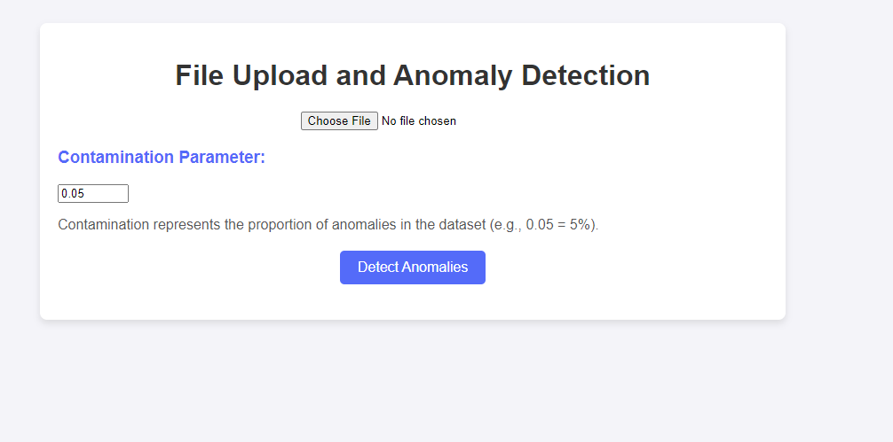

# Anomaly Detection using Isolation Forest with Flask   🚀️

This project is a web application for detecting anomalies in data using the Isolation Forest algorithm. The application is built with Flask and allows users to upload CSV files, select columns for analysis, and view the results of the anomaly detection.

## Features

- Upload CSV files for analysis
- Select specific columns for anomaly detection
- Perform anomaly detection using Isolation Forest
- View summary statistics and anomaly detection results

## Requirements

- Python 3.12
- Flask==3.1.0
- pandas==1.5.3
- flask-cors==5.0.0
- scikit-learn==1.6.0
- numpy==2.2.1

## Installation

1. Clone the repository:

   ```bash
   git clone https://github.com/linngem/anomaly_detection.git
   cd anomaly-detection
   ```
2. Install the required packages:

   ```bash
   pip install -r requirements.txt
   ```
3. Run the application:

   ```bash
   python index.py
   ```
4. Open your web browser and go to `http://127.0.0.1:5000/`.

   

## Usage

1. Upload a CSV file using the provided form.
2. Select the columns you want to analyze for anomalies.
3. Click the "Submit" button to perform the anomaly detection.
4. View the results, including summary statistics and the percentage of anomalies detected.

## API Endpoints

- `GET /`: Renders the main page.
- `POST /get_columns`: Accepts a CSV file and returns the column names.
- `POST /upload`: Accepts a CSV file and performs anomaly detection on the selected columns.

## Example

Here is an example of how to use the API endpoints:

1. Upload a CSV file to get the column names:

   ```bash
   curl -X POST -F 'file=@yourfile.csv' http://127.0.0.1:5000/get_columns
   ```
2. Upload a CSV file and perform anomaly detection:

   ```bash
   curl -X POST -F 'file=@yourfile.csv' -F 'columns=["column1", "column2"]' -F 'contamination=0.05' http://127.0.0.1:5000/upload
   ```

## License

This project is licensed under the MIT License.
